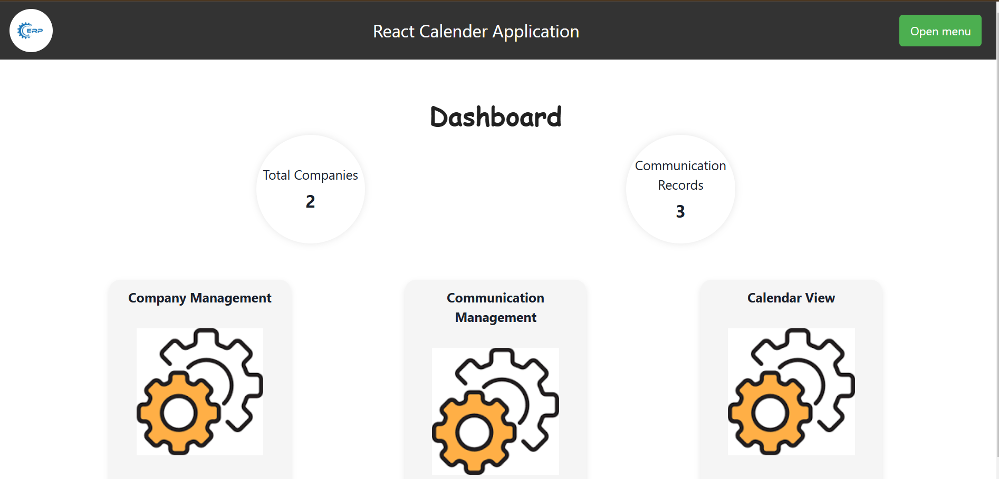
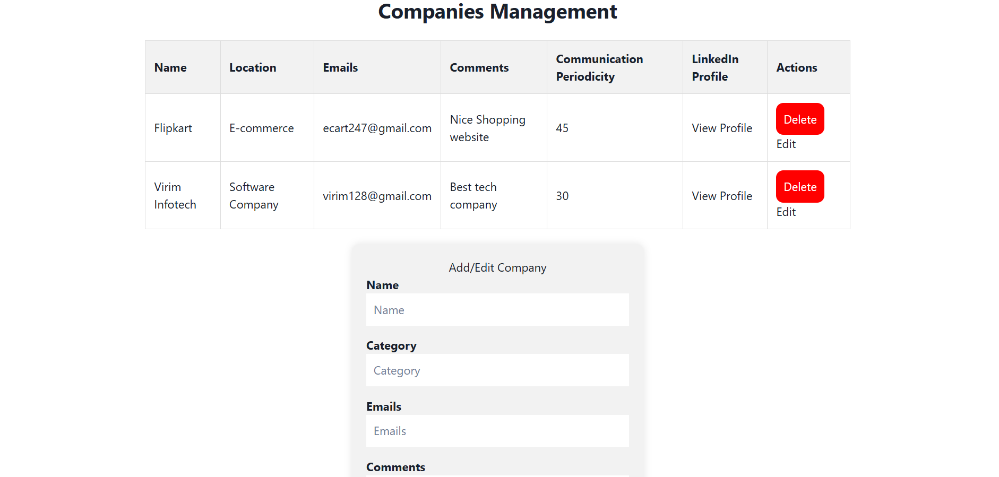
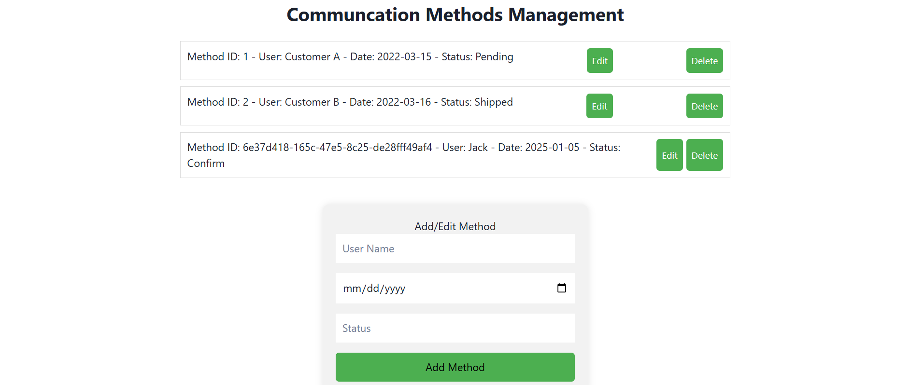
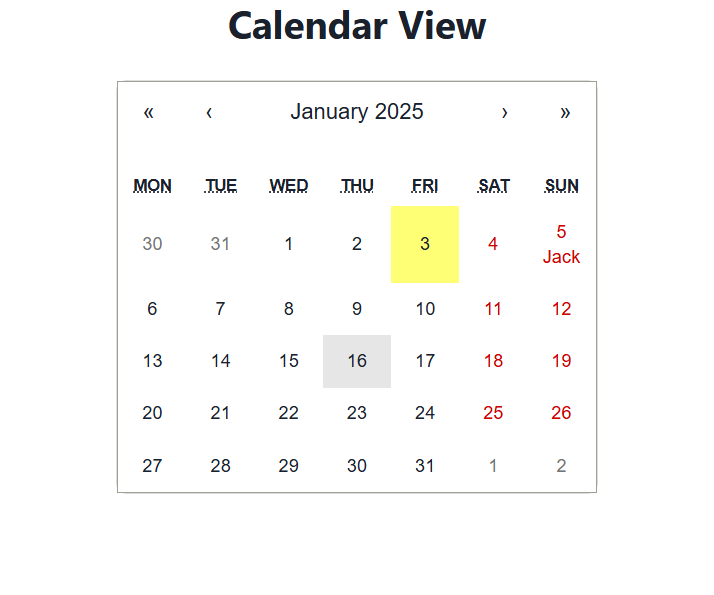

# Calendar Application for Communication Tracking

## Objective
The Calendar Application is designed to maintain accurate records of professional interactions with companies, ensuring timely follow-ups and consistent engagement. This tool offers a centralized platform for:

- Logging past interactions.
- Planning future communications.
- Managing engagement frequency based on predefined schedules.

## Features Overview

### Admin Module
The Admin Module allows administrators to configure the application and manage foundational data:

#### **Company Management**
Admins can add, edit, and delete companies, with the following details:
- **Name**: Name of the company.
- **Location**: Physical or operational location.
- **LinkedIn Profile**: Link to the company's LinkedIn page.
- **Emails**: One or more email addresses for communication.
- **Phone Numbers**: Contact numbers for representatives.
- **Comments**: Notes or additional information about the company.
- **Communication Periodicity**: Default time interval for scheduled communications (e.g., every 2 weeks).

#### **Communication Method Management**
Admins can define communication methods, including:
- **Name**: E.g., "Visit" or "LinkedIn Post".
- **Description**: E.g., "Visit to company premises".
- **Sequence**: Determines the order of communication (e.g., LinkedIn Post → LinkedIn Message → Email → Phone Call → Other).
- **Mandatory Flag**: Indicates whether a communication method is mandatory in the sequence.

**Default Communication Methods:**
1. LinkedIn Post
2. LinkedIn Message
3. Email
4. Phone Call
5. Other

### User Module
The User Module provides the primary interface for end-users to manage communication tasks.

#### **Dashboard**
A grid view with:
- **Company Name**: The name of the company.
- **Last Five Communications**: Summary of the five most recent communications (type and date).
- **Next Scheduled Communication**: Type and date of the next planned communication.

**Color-Coded Highlights:**
- **Red**: Overdue communication.
- **Yellow**: Communication due today.
- Users can disable or override highlights for specific companies or communications.

#### **Interactive Features**
- **Hover Effect**: Displays notes or comments recorded for completed communications.

#### **Communication Action**
Users can:
- Select one or multiple companies.
- Log new communications via the "Communication Performed" button.
  - **Action Modal:**
    - Select type of communication.
    - Input date of communication.
    - Add notes.
  - Resets existing highlights (red or yellow) upon submission.

#### **Notifications**
- **Overdue Communications Grid**: Lists companies with overdue actions.
- **Today’s Communications Grid**: Lists companies with tasks due today.
- Notification badge displays count of overdue and due communications.

#### **Calendar View**
- **Past Communications**: Dates and methods of previous interactions.
- **Upcoming Communications**: Scheduled dates and methods for future interactions.

---

## Deployment
The application is deployed on a live platform for evaluation:
- **Live URL**: https://react-calendar-application-mauve.vercel.app/

---

## Screenshots

Below are the screenshots showcasing the application:

### Dashboard Page
[](./src/assets/dashboard.png)

### Company Page
[](./src/assets/company.png)

### Communication Methods Management
[](./src/assets/methods.png)

### Calendar View
[](./src/assets/calender.png)


## Setup Instructions

1. Clone the repository:
   ```bash
   git clone https://github.com/gujjarsahab21/React-Calendar-Application.git
   ```

2. Install dependencies:
   ```bash
   npm install
   ```

3. Start the development server:
   ```bash
   npm start
   ```

4. Build for production:
   ```bash
   npm run build
   ```

5. Deploy the application using Vercel, Netlify, or GitHub Pages.

---

## Testing and Validation
- Ensure smooth operation with no errors.
- Perform thorough testing to resolve usability issues.
- Include sample data for mock companies, communication methods, and schedules.

---

## Libraries and Tools
- **React**: Frontend framework.
- **FullCalendar**: For calendar functionality.
- **Tailwind CSS**: For styling.
- **Redux**: For state management.

---

## Contact
For questions or clarifications, contact: harshgujjar2120@gmail.com

